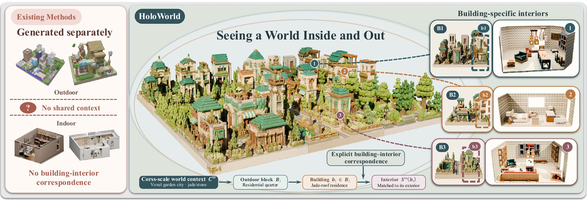

# HoloWorld

## To See a World in a Living Context: Unified Indoor-Outdoor Urban World Generation

**Xiaobin Huang, Zilong Huang, Yang Luo, Hongchao Fan, Yiping Chen, Ting Han**

<p align="center">
  <a href="https://huangxb326.github.io/HoloWorld/"><strong>Project Page</strong></a>
  &nbsp;·&nbsp;
  <a href="https://arxiv.org/abs/2608.05879"><strong>Paper</strong></a>
  &nbsp;·&nbsp;
  <a href="https://huangxb326.github.io/holoworld-demo-explorer/?case=switch"><strong>Interactive Demo</strong></a>
</p>

<p align="center">
  <a href="https://huangxb326.github.io/HoloWorld/">
    
  </a>
</p>

## Overview

Text-driven 3D generation has advanced rapidly in creating large-scale outdoor environments and detailed indoor scenes, but these domains are usually synthesized independently, lacking the correspondence required for a coherent urban world. We present **HoloWorld**, a unified indoor-outdoor urban world generation framework built on a continuously updated cross-scale world context.

HoloWorld progressively represents and updates information from city-scale planning to individual buildings. This evolving context supports consistent urban exterior generation, grounds buildings in explicit 3D instances and footprints, and enables building-specific indoor generation with geometry-constrained layouts and inherited appearance characteristics.

To our knowledge, **HoloWorld is the first framework to unify indoor and outdoor generation within a coherent 3D urban world**.

## Highlights

- Unified generation of urban exteriors and their corresponding building interiors.
- Continuously evolving world context across world, block, and building scales.
- Autoregressive block generation with consistent spatial organization and visual identity.
- Building-specific indoor synthesis conditioned on geometry, assets, appearance, and footprint.
- Interactive exploration of generated HoloWorld cities through the online demo.

## Project Resources

- **Project page:** https://huangxb326.github.io/HoloWorld/
- **Paper:** https://arxiv.org/abs/2608.05879
- **Interactive demo:** https://huangxb326.github.io/holoworld-demo-explorer/?case=switch
- **Website source:** this repository

## Citation

If you find HoloWorld useful, please cite:

```bibtex
@article{huang2026holoworld,
  title={To See a World in a Living Context: Unified Indoor-Outdoor Urban World Generation},
  author={Huang, Xiaobin and Huang, Zilong and Luo, Yang and Fan, Hongchao and Chen, Yiping and Han, Ting},
  journal={arXiv preprint arXiv:2608.05879},
  year={2026}
}
```
